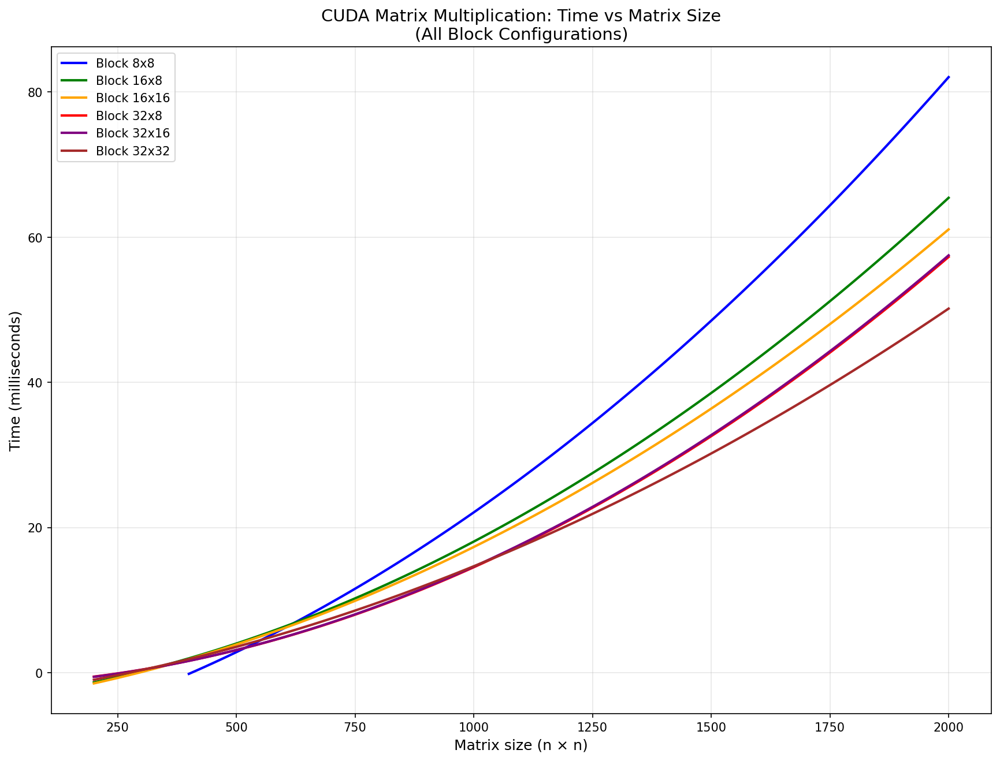

# Лабораторная работа №4: Умножение матриц (CUDA версия)

## Задание

Модифицировать программу из лабораторной работы №1 для параллельной работы с использованием технологии CUDA. Провести эксперименты с разными размерами матриц и различными конфигурациями сетки блоков.

## Реализация

Программа реализует умножение двух квадратных матриц целых чисел с использованием GPU. Основные компоненты:

- **Ядро CUDA**: `multiplyKernel` выполняет поэлементное умножение строки матрицы A на столбец матрицы B
- **Класс Matrix**: Инкапсулирует данные матрицы и методы для работы с файлами
- **Тестирование конфигураций**: 6 различных размеров блоков (8×8, 16×8, 16×16, 32×8, 32×16, 32×32)
- **Размеры матриц**: 200, 400, 800, 1200, 1600, 2000

## Результаты экспериментов

### Время выполнения (миллисекунды)

| Размер | 8×8 | 16×8 | 16×16 | 32×8 | 32×16 | 32×32 | Лучший |
|--------|-----|------|-------|------|-------|-------|--------|
| 200×200 | **0.51** | 0.65 | 0.56 | 0.58 | 0.56 | 0.53 | 32×32 |
| 400×400 | 1.86 | **1.58** | 1.66 | 1.63 | 1.66 | 1.68 | 16×8 |
| 800×800 | 11.19 | 8.65 | 8.02 | 7.12 | 7.03 | **6.93** | 32×32 |
| 1200×1200 | 26.68 | 21.27 | 19.24 | 18.23 | 18.52 | **17.88** | 32×32 |
| 1600×1600 | 63.77 | 53.51 | 52.35 | 43.50 | 43.59 | **41.02** | 32×32 |
| 2000×2000 | 78.33 | 60.94 | 56.04 | 54.41 | 54.63 | **46.88** | 32×32 |

## Сравнение с последовательной версией (C++)

| Размер | C++ (последовательная) | CUDA (Tesla T4) | Ускорение |
|--------|------------------------|-----------------|-----------|
| 200×200 | 150.67 мс | 0.51 мс | **284×** |
| 400×400 | 931.80 мс | 1.58 мс | **590×** |
| 800×800 | 8507.31 мс | 6.93 мс | **1228×** |
| 1200×1200 | 30644.00 мс | 17.88 мс | **1714×** |
| 1600×1600 | 78319.68 мс | 41.02 мс | **1909×** |
| 2000×2000 | 167009.58 мс | 46.88 мс | **3563×** |

## Результаты



## Анализ результатов

### 1. Зависимость времени от размера матрицы

Время выполнения растёт пропорционально O(n³), что соответствует теоретической сложности алгоритма умножения матриц. 

### 2. Влияние размера блока

- **Для средних матриц (400×400)**: Конфигурация 16×8 показывает наилучший результат.
- **Для больших матриц (≥800×800)**: Блок 32×32 стабильно даёт наилучшую производительность.

### 3. Эффективность использования GPU

- GPU значительно эффективнее CPU для матриц размером более 400×400
- Ускорение растёт с увеличением размера задачи
- Максимальное ускорение (~3500×) достигнуто для матрицы 2000×2000

## Выводы

1. **CUDA обеспечивает колоссальное ускорение** по сравнению с последовательной реализацией на CPU — до 3500 раз для больших матриц.

2. **Оптимальная конфигурация блоков зависит от размера матрицы**:
   - Для матриц 200×200: блок 8×8
   - Для матрицы 400×400: блок 16×8
   - Для матриц ≥800×800: блок 32×32

3. **Параллельная реализация масштабируется лучше** последовательной: при увеличении размера с 200 до 2000 (в 10 раз) время на CPU растёт в ~1100 раз, а на GPU — только в ~90 раз.

## Файлы программы

- `cuda.cu` — исходный код программы на C++/CUDA
- `cuda_results.txt` — подробные результаты тестирования
- `timing_data.txt` — таблица с замерами времени


## Запуск программы

```bash
# Компиляция
nvcc -o cuda cuda.cu

# Запуск
./cuda
