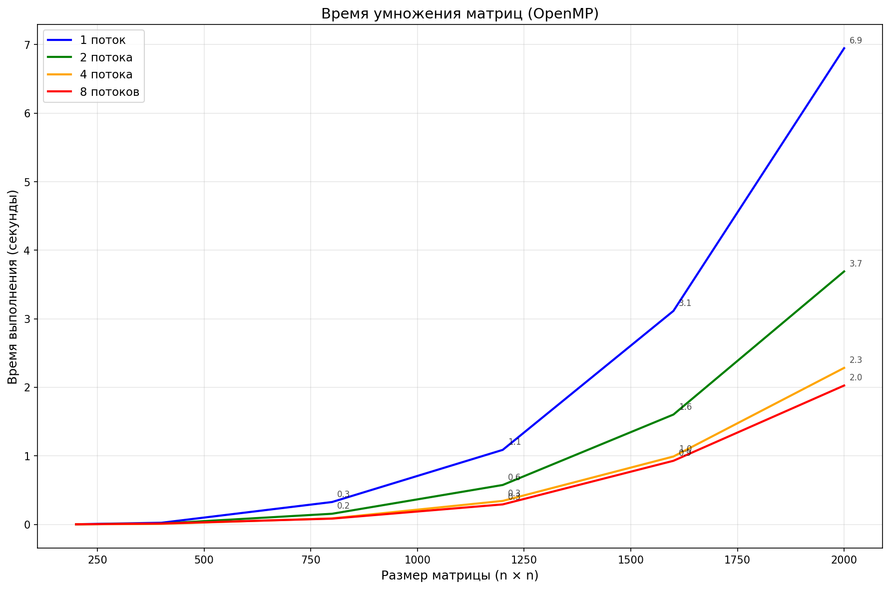

# Лабораторная работа №2: Параллельное умножение матриц с использованием OpenMP

## Цель работы

Модифицировать программу из лабораторной работы №1 для параллельного умножения квадратных матриц с использованием технологии OpenMP. Провести серию экспериментов с разным количеством потоков (1, 2, 4, 8) и разными размерами матриц (200×200, 400×400, 800×800, 1200×1200, 1600×1600, 2000×2000). Выполнить верификацию результатов и проанализировать ускорение параллельных вычислений.

## Реализация

### Модификация программы

В перегрузку оператора `operator*` была добавлена директива OpenMP:

## Время выполнения (секунды)

| Размер | 1 поток | 2 потока | 4 потока | 8 потоков |
|--------|---------|----------|----------|-----------|
| 200×200 | 0.00257 | 0.00182 | 0.00168 | 0.00193 |
| 400×400 | 0.02409 | 0.01222 | 0.00772 | 0.01290 |
| 800×800 | 0.32684 | 0.15562 | 0.08825 | 0.08449 |
| 1200×1200 | 1.08783 | 0.57543 | 0.34304 | 0.29217 |
| 1600×1600 | 3.11520 | 1.60318 | 0.99098 | 0.92846 |
| 2000×2000 | 6.94700 | 3.69112 | 2.28375 | 2.02670 |

## График
График показывает, как меняется время умножения матриц при увеличении их размера для разного количества потоков (1, 2, 4, 8).

Время растёт как n³ — сложность O(n³).
Параллельное умножение матриц с использованием OpenMP позволяет значительно ускорить вычисления.

## Ускорение (относительно 1 потока)

| Размер | 2 потока | 4 потока | 8 потоков |
|--------|----------|----------|-----------|
| 200×200 | 1.41 | 1.53 | 1.33 |
| 400×400 | 1.97 | 3.12 | 1.87 |
| 800×800 | 2.10 | 3.70 | 3.87 |
| 1200×1200 | 1.89 | 3.17 | 3.72 |
| 1600×1600 | 1.94 | 3.14 | 3.36 |
| 2000×2000 | 1.88 | 3.04 | 3.43 |

## Итог

- **Малые матрицы (≤400×400)** — ускорение незначительное или отсутствует из-за накладных расходов.
- **Средние и большие матрицы (≥800×800)** — ускорение достигает **3.7–3.9×** на 4–8 потоках.
- **4 потока** дают оптимальный баланс: ускорение ~3× при эффективности 75–95%.
- **8 потоков** чуть быстрее на больших размерах, но эффективность падает из-за ограничений памяти.

## Верификация

Скрипт на Python с NumPy подтвердил правильность вычислений. Все результаты совпали.

### ВЫВОД
В ходе выполнения лабораторной работы была разработана параллельная программа 
умножения матриц с использованием OpenMP. Экспериментально подтверждена 
кубическая сложность алгоритма O(n³). Установлено, что использование 8 потоков 
позволяет ускорить вычисления.
Верификация подтвердила корректность параллельных вычислений.
