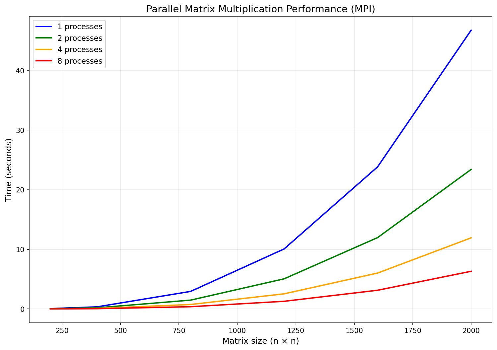

# Лабораторная работа №5: Запуск программы на MPI на суперкомпьютере «Сергей Королёв»

## Цель работы
 Параллельную версию программы на MPI запустить на суперкомпьютере «Сергей Королёв».
 
## Вычислительная среда
- **Размеры матриц**: 200, 400, 800, 1200, 1600, 2000
- **Количество процессов**: 1, 2, 4, 8

## Результаты измерений времени (в секундах)

| Размер матрицы | 1 процесс | 2 процесса | 4 процесса | 8 процессов |
|----------------|-----------|------------|------------|--------------|
| 200×200        | 0.05845    | 0.04405    | 0.02193    | 0.01300      |
| 400×400        | 0.35425    | 0.19527    | 0.09111    | 0.04668      |
| 800×800        | 2.94452    | 1.48185    | 0.74997    | 0.37890      |
| 1200×1200      | 10.07173   | 5.05889    | 2.53660    | 1.28516      |
| 1600×1600      | 23.84801   | 11.97439   | 6.02534    | 3.13906      |
| 2000×2000      | 46.75995   | 23.40801   | 11.93282   | 6.32170      |

## Верификация корректности
Все результаты успешно верифицированы сравнением с эталонным умножением с помощью `numpy. Результаты в файле verify_results.txt

## График

### Анализ графика

Из графика видно:

1. **Ускорение при параллельном вычислении**: С увеличением количества процессов время выполнения уменьшается для всех размеров матриц.

2. **Эффективность параллелизации**: Наибольший эффект от увеличения числа процессов наблюдается для больших матриц (1600×1600 и 2000×2000).

3. **Сложность алгоритма**: Время выполнения растёт пропорционально O(n³), что соответствует теоретической сложности умножения матриц.

## Вывод

В ходе работы программа была запущена на суперкомпьютере «Сергей Королёв». Для каждого размера матрицы (200, 400, 800, 1200, 1600, 2000) выполнялись запуски с 1, 2, 4 и 8 процессами. Все результаты измерений были сохранены в файлы, а затем проверены с помощью скрипта верификации.

