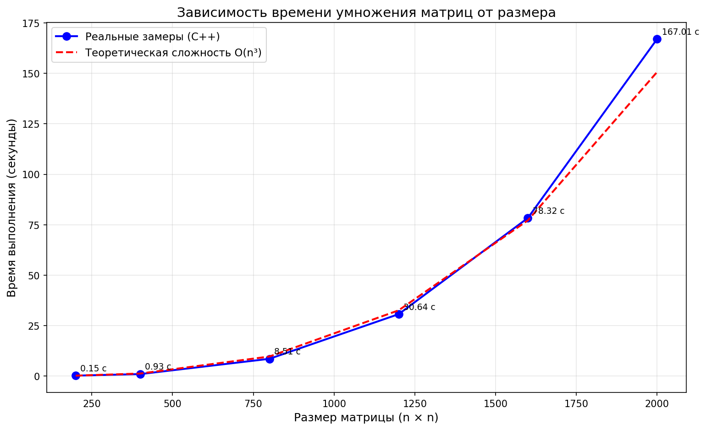

# Лабораторная работа №1: Умножение матриц

## Задание

Написать программу на C++ для умножения двух квадратных матриц. Провести замеры времени для матриц разного размера. Выполнить верификацию с помощью Python/NumPy.

## График

Время растёт как n³ — сложность O(n³).

## Верификация

Скрипт на Python с NumPy подтвердил правильность вычислений. Все результаты совпали.

## Файлы

- `parall1.cpp` — программа на C++
- `verify.py` — проверка результатов
- `plot.py` — построение графика
- `A_*.txt`, `B_*.txt` — исходные матрицы
- `C_*.txt` — результаты умножения
